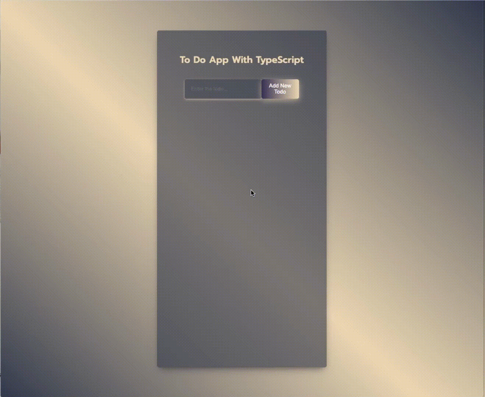

# ToDo App with Typscript

A ToDo App Project created by using TypeScript

<hr />

## What I Used

- TypeScript

### Demo

#### [View Demo](https://todoapp-typscript.vercel.app/)



<hr />

### Project start command 

```
$ npx create-react-app my-app --template typescript
```


Adding typescript=>https://create-react-app.dev/docs/adding-typescript/

Other ready template commands => https://www.npmjs.com/search?q=cra%20--
